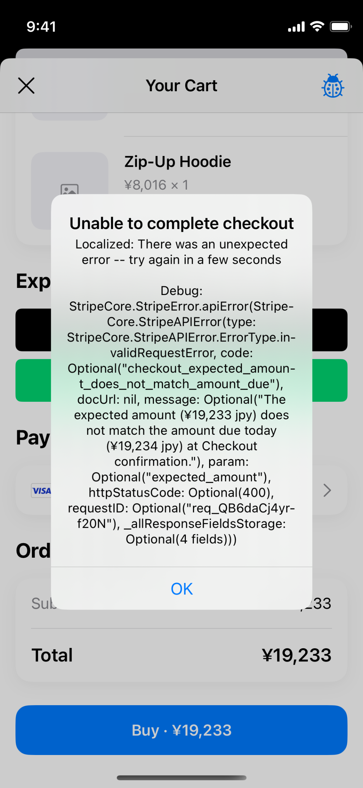

# JPY checkout fails: item totals are ¥19,233, but the backend requires ¥19,234

**Failed confirmation request: `req_QB6daCj4yrf20N`**

**Status: unresolved. A CSE-only display change does not fix this.** This commit documents the issue; it does not include the rejected display candidate.

## Confirmation failure

The test-mode confirmation returned **HTTP 400**:

| Field | Value |
| --- | --- |
| Request ID | `req_QB6daCj4yrf20N` |
| Error code | `checkout_expected_amount_does_not_match_amount_due` |
| Parameter | `expected_amount` |
| Client expected amount | **19233 JPY** |
| Backend amount due | **19234 JPY** |

> The expected amount (¥19,233 jpy) does not match the amount due today (¥19,234 jpy) at Checkout confirmation.

The screenshot contains the error, request ID, and displayed cart total. The request ID wraps across lines in the screenshot; the unbroken value above is the value to look up.

## The inconsistent values are already in the backend response

For the same checkout, the captured JPY response contains:

| Response field / calculation | JPY minor units |
| --- | ---: |
| First `checkout_items[].one_time_price.items[].total` | 11217 |
| Second `checkout_items[].one_time_price.items[].total` | 8016 |
| Sum used by `Session.totals.total` and `expected_amount` | **19233** |
| `adaptive_pricing_info.local_currency_options[]` JPY `amount` | **19234** |
| `total_summary.total` | **19234** |
| `total_summary.due` | **19234** |

The integration amount is **12006 USD minor units ($120.06)**. The reported presentment exchange rate is `160.203232`.

The SDK sums the backend's **item totals** under [#6876](https://github.com/stripe/stripe-ios/pull/6876), as subsequently updated by [#7029](https://github.com/stripe/stripe-ios/pull/7029). It does not calculate these totals by multiplying the rounded unit-price labels in the cart. Confirmation sends that same session total as `expected_amount`.

## Reproduce

1. In PaymentSheet Example's Checkout Playground, set the test cart to **Classic T-Shirt: $35.01 × 2** and **Zip-Up Hoodie: $50.04 × 1**. These prices were temporarily configured in `CheckoutPlayground.LineItemConfig.defaults` for QA.
2. Use **SwiftUI**, PaymentElement **sheet**, integration currency **USD**, **Guest**, and Adaptive Pricing location **Japan**. Disable shipping collection, automatic tax, and payment-method saving. Use the hosted test backend.
3. Create the session and keep JPY selected. The session/cart total is **¥19,233** while the backend quote and amount due are **¥19,234**.
4. Select the repository's test Visa ending in **4242** and confirm. Observe the HTTP 400 error above.
5. Dismiss the error, switch the same session to USD, and confirm using the same test card. This control succeeded for **$120.06**, with payment status `.paid`.

Observed on **2026-09-14 UTC**, iPhone 12 mini / iOS 18.0, normal app launch without `UITesting`, based on upstream commit `223617f94b5c651dd6bccb2e523e2497860dc908`. Exchange rates change, so these exact prices may not cross the same rounding boundary later; the request ID preserves the failing case.

## Why changing only CSE is insufficient

The proposed CSE change reads the session total for the selected currency and retains the backend quote for the other currency. With these responses, it produces:

| Selection | JPY option displays |
| --- | ---: |
| JPY selected | **¥19,233** |
| Switch to USD | **¥19,234** |
| Switch back to JPY | **¥19,233** |

This price jump reproduced on **2/2 round trips**. It switches between unequal inputs; it is not accumulated conversion or rounding in CSE. JPY confirmation failed on **1/1 attempt**; the unchanged failure was not retried. The candidate did not change session-total calculation or confirmation. A separate baseline confirmation run was not performed.

**Required invariant: localized item totals must sum to the advertised quote and the amount due at confirmation.** Preserving #6876 therefore requires reconciling those backend values. A selector-only change cannot satisfy both session consistency and stable option prices while they differ. The exact server rounding algorithm was not established by this investigation.

## Validation of this commit

No new tests. Documentation and the original confirmation screenshot only; the failing CSE candidate and temporary QA instrumentation are not included.
