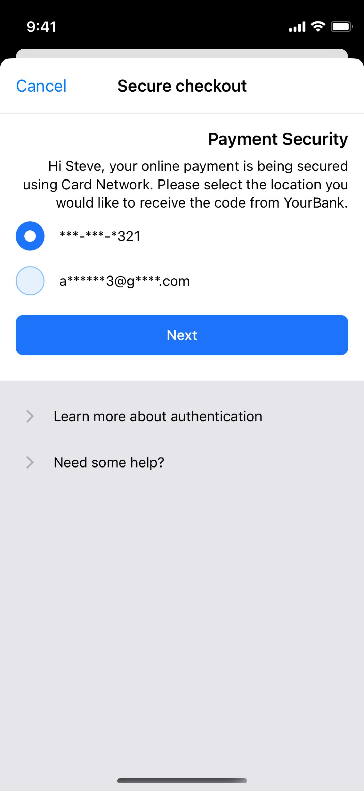
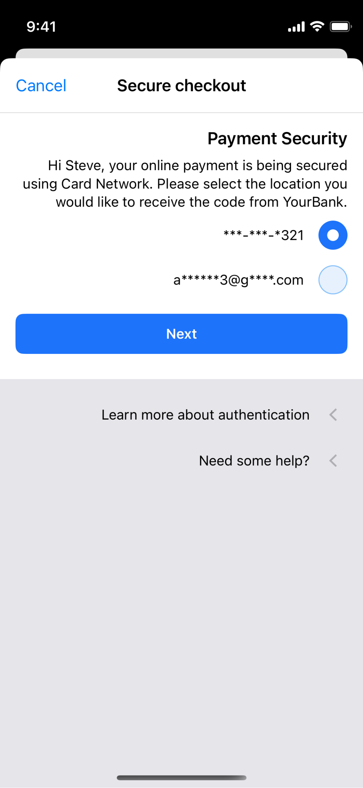
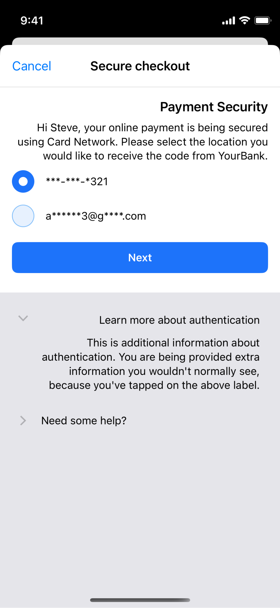
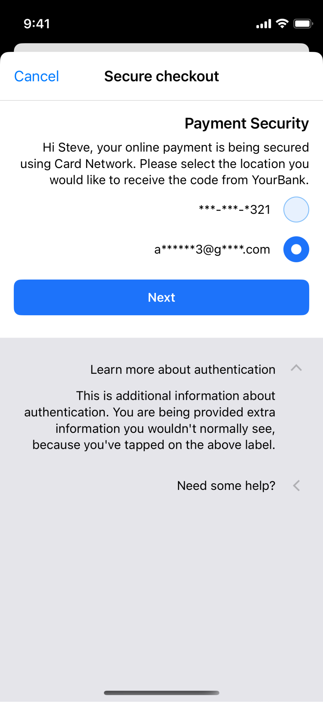
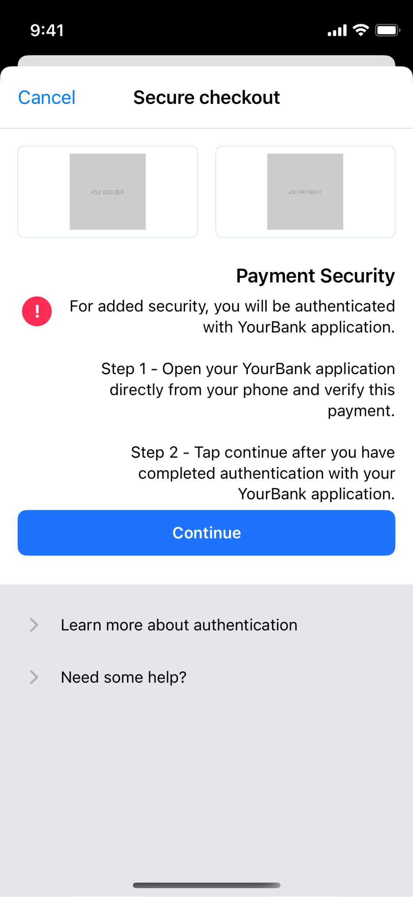
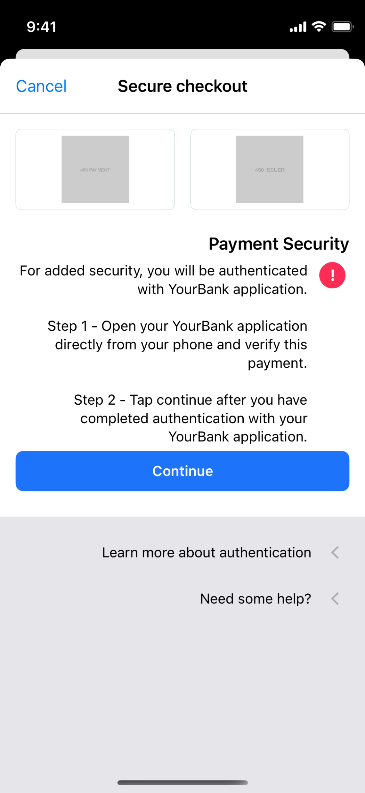
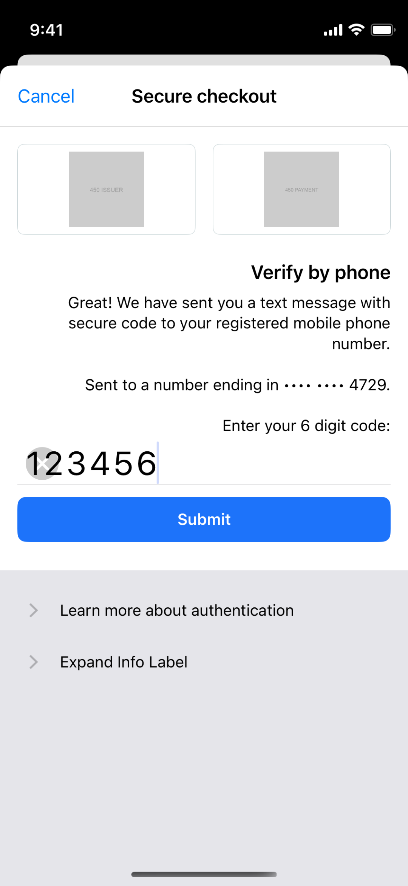
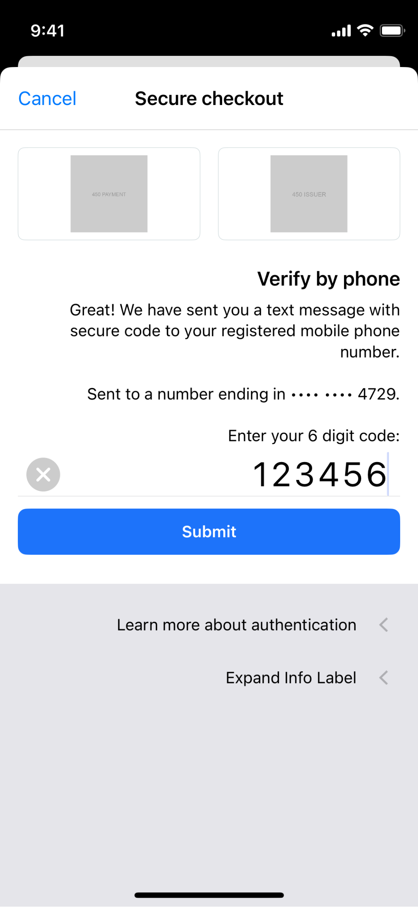

# Native 3DS2 RTL Simulator evidence

These screenshots compare current `master` (`1e451705aca`) with production commit `d7379d15286` on the existing iOS 18.0 iPhone 12 mini Simulator. Both builds were launched with:

```text
-AppleTextDirection YES -NSForceRightToLeftWritingDirection YES
```

Only behavior changed by this branch is documented here. UIKit already moved the Cancel button, applied natural label alignment, mirrored the whitelist row, centered the progress presentation, and preserved issuer/network logos on `master`, so those screens are intentionally omitted. ACS-provided HTML challenges are not native SDK UI and remain out of scope.

## Selection rows and collapsed disclosures

The custom horizontal stack now follows semantic leading/trailing order. Selection controls and disclosure chevrons move to the RTL side, and collapsed chevrons point toward the content they reveal.

| Before (`master`) | After |
| --- | --- |
|  |  |

## Expanded disclosure

The same semantic layout keeps the disclosure control and its expanded content aligned on the RTL side. The control was also manually opened and collapsed to verify interaction and accessibility state changes.

| Before (`master`) | After |
| --- | --- |
|  |  |

## Out-of-band warning row

The warning image now moves with the custom horizontal row instead of remaining on the physical left.

| Before (`master`) | After |
| --- | --- |
|  |  |

## One-time-code field

The custom text rect now preserves the space UIKit reserves for its RTL clear button. The code no longer overlaps the clear control, and the clear control was manually exercised successfully.

| Before (`master`) | After |
| --- | --- |
|  |  |
