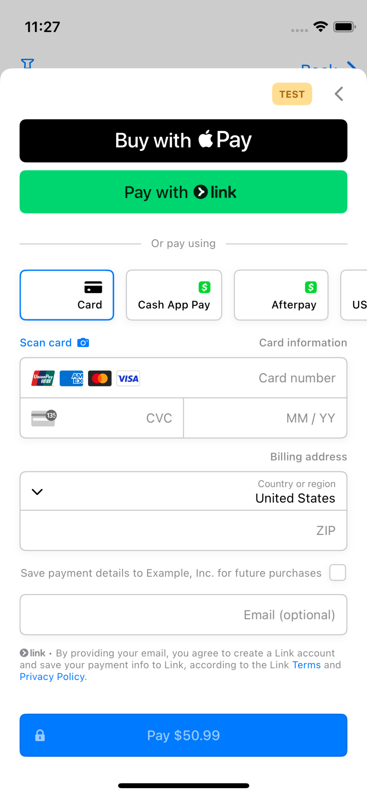
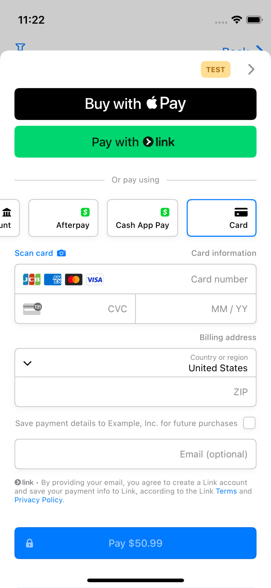
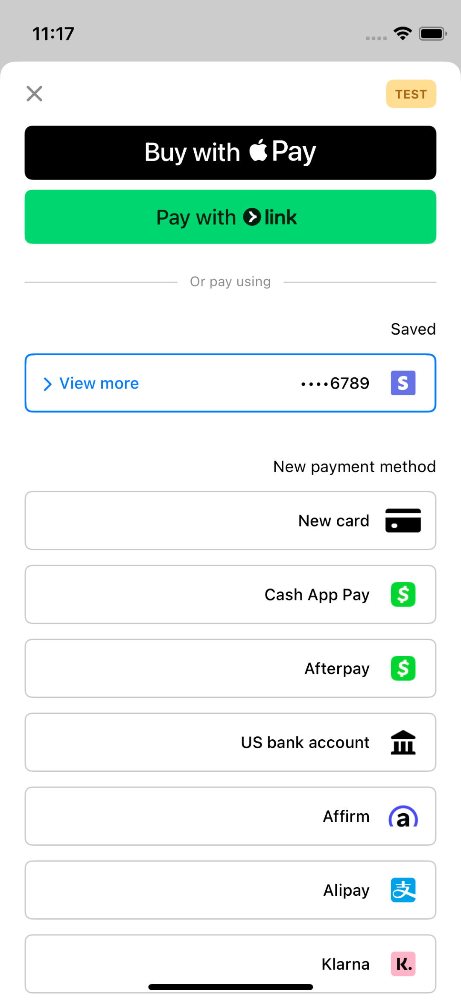
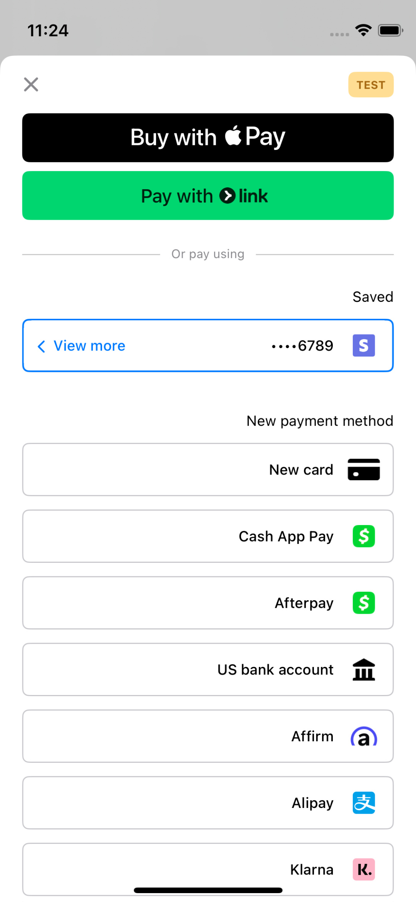
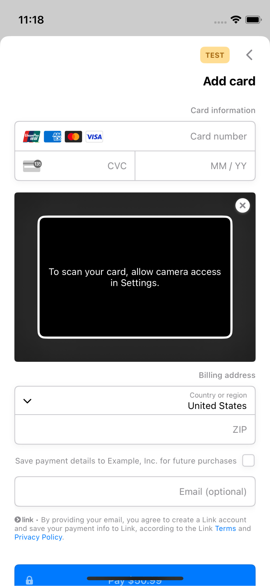
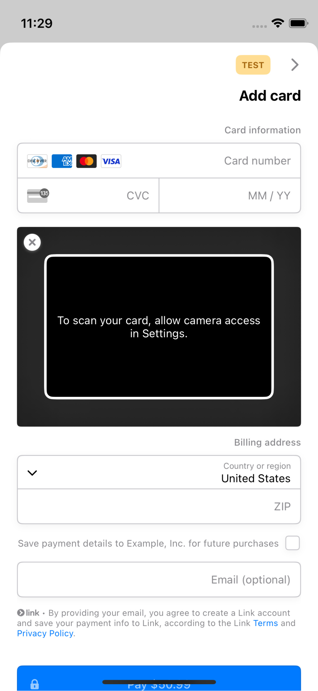

# PR2 RTL Simulator evidence

These screenshots were captured by manually operating the production
`PaymentSheet` playground in Simulator. They are not XCTest or snapshot-test
output. Every pair uses the same playground state before and after PR2.

| | Value |
| --- | --- |
| Before | `df4813f5470` (`master`) |
| After production code | `d595a865c59` |
| Captured after build | `b03f5cb63c4` |
| Simulator | iPhone 12 mini, iOS 18.0 (`79CA7DB2-0A4B-4EC4-B93C-D28E8C9458F1`) |
| App | `com.stripe.PaymentSheet-Example` |
| Launch | Normal launch with `-AppleTextDirection YES -NSForceRightToLeftWritingDirection YES`; no `UITesting` environment |
| Capture | Native Simulator framebuffer via `xcrun simctl io … screenshot`; no desktop window, pointer, or overlay |
| Before app SHA-256 | `42f8ec5c322ea01fbf1af140b75547ea604bb4f95b0d6629dd1c11ad9a061ed8` |
| After app SHA-256 | `3f0b04b1d3f2e9ec8cefbb9fa0be7562083cad95a668e1f9d6def06fda51e31a` |
| Before `StripePaymentSheet` SHA-256 | `5cc67aabcd4ee5a3ff087602c6aacf80339017ba667c087d03ca518dd86f34ce` |
| After `StripePaymentSheet` SHA-256 | `74a17ff843f67117f2f8a062441da3d39b93163efd478fd942c8797892087631` |

## New-payment-method carousel and navigation

The horizontal layout uses a returning customer and opens `+ Add`. Before,
Card starts at the physical left and the back indicator points left. After,
Card starts at the RTL leading edge on the right, the logical payment-method
order proceeds right-to-left, and Back points right toward the previous screen.

| Before | After |
| --- | --- |
|  |  |

## Saved-method accessory

The vertical layout uses the same returning customer. Before, the `View more`
indicator points right. After, it points left toward RTL forward navigation.

| Before | After |
| --- | --- |
|  |  |

## Card-scanner close placement

The vertical Card form opens the scanner with camera access disabled. Before,
the scanner close control remains on the physical right. After, it occupies the
RTL trailing side on the left. The surrounding form and scanner state are
otherwise unchanged.

| Before | After |
| --- | --- |
|  |  |
