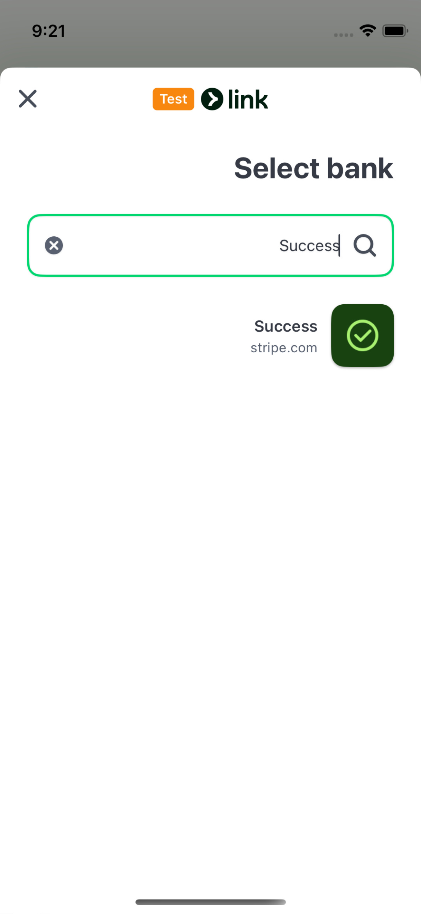
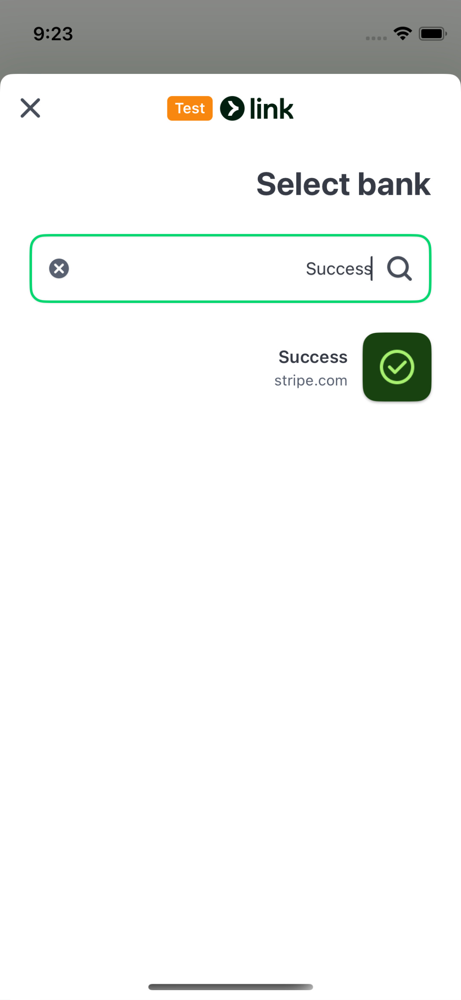
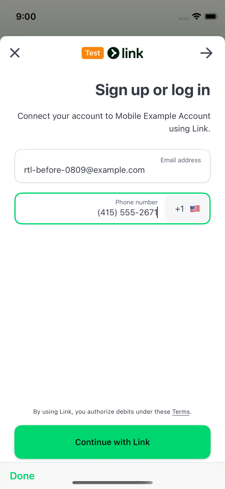
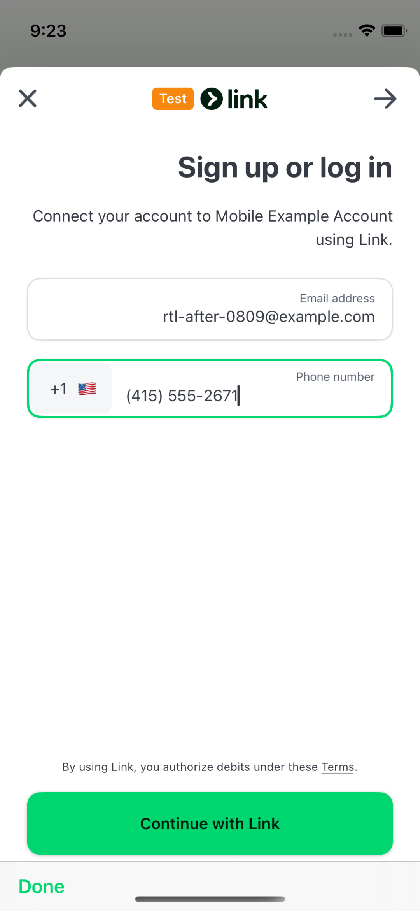
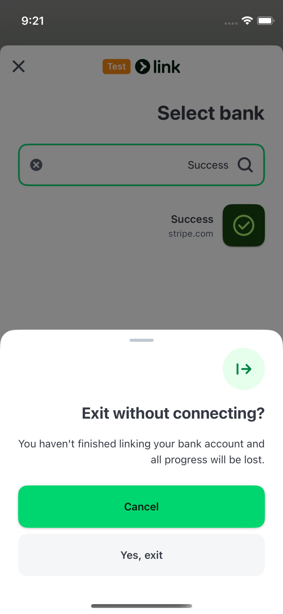
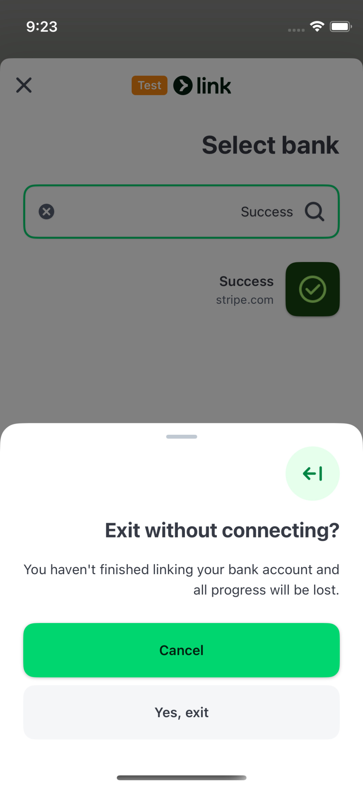

# PR3 RTL Simulator evidence

These screenshots were captured by manually operating the `PaymentSheet Example`
app in Simulator. They are not XCTest or snapshot-test output.

| | Value |
| --- | --- |
| Before | `4931a8cfc20271084946baa46714035c89437df9` (`codex/rtl-paymentsheet`) |
| After production code | `0a05a62e258` |
| Simulator | iPhone 12 mini, iOS 18.0 (`79CA7DB2-0A4B-4EC4-B93C-D28E8C9458F1`) |
| App | `com.stripe.PaymentSheet-Example` |
| Launch | Normal launch with `-AppleTextDirection YES -NSForceRightToLeftWritingDirection YES`; no `UITesting` environment |
| Capture | Native Simulator framebuffer via `xcrun simctl io … screenshot`; no desktop window, pointer, or overlay |
| Xcode | 26.4.1 (17E202) |
| Before `StripeFinancialConnections` SHA-256 | `c5209c32dc28ca224c9e401cf6bc5b3e8d31026c4be18badb75fe9d5edf5cb07` |
| After `StripeFinancialConnections` SHA-256 | `a7d70fc0ac4c7e1c508d5ef7c7906780ff8625d11317ad3ee2771da1b9f012eb` |

The native Financial Connections screens end before any bank-owned web view.
Bank authentication web content was deliberately excluded from this audit.

## Institution search

Oracle: an active short-text search value follows the RTL interface alignment.
Before, `Success` snaps to the left when entered. After, it remains right-aligned.

| Before | After |
| --- | --- |
|  |  |

## Phone field

Oracle: phone data preserves its intrinsic LTR order while the surrounding UI is
RTL. Before, the country code appears on the trailing side. After, `+1` and the
formatted number form one contiguous LTR compound field on the leading side.

| Before | After |
| --- | --- |
|  |  |

## Exit confirmation direction icon

Oracle: the directional icon mirrors with the interface. Before, it points right.
After, it points left. Both captures use the same institution-search state.

| Before | After |
| --- | --- |
|  |  |
