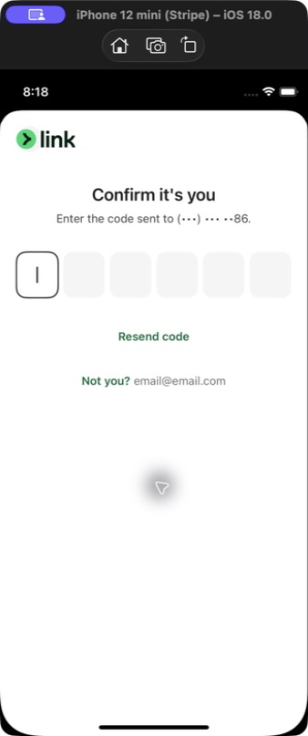
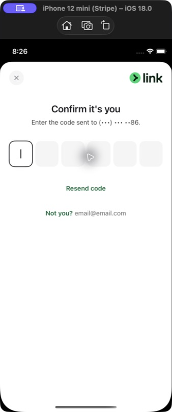
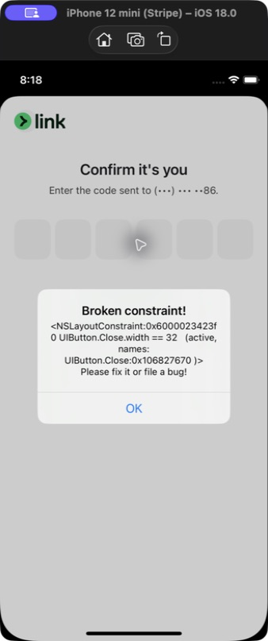
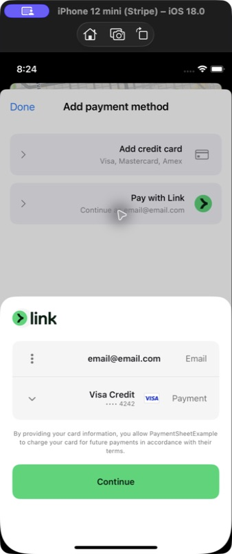
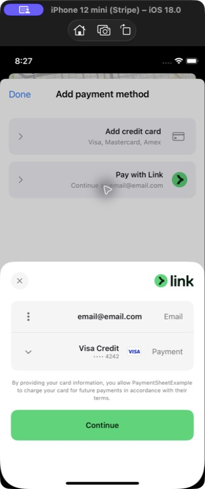
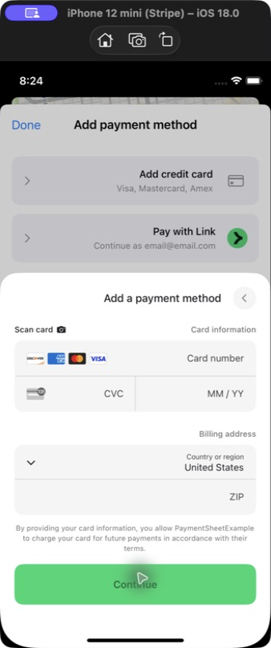
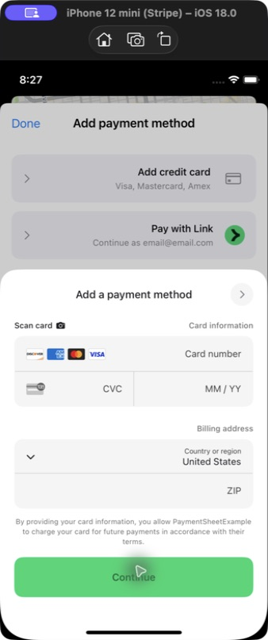

# PR4 RTL Simulator evidence

These screenshots were captured by manually operating the `PaymentSheet Example`
app in Simulator. They are not XCTest or snapshot-test output.

| | Value |
| --- | --- |
| Before | `6db450719f7` (`codex/rtl-checkout-components`) |
| After production code | `7382d1ba348` |
| Simulator | iPhone 12 mini, iOS 18.0 (`79CA7DB2-0A4B-4EC4-B93C-D28E8C9458F1`) |
| App | `com.stripe.PaymentSheet-Example` |
| Launch | Normal launch with `-AppleTextDirection YES -NSForceRightToLeftWritingDirection YES`; no `UITesting` environment |
| Xcode | 26.4.1 (17E202) |
| Before `StripePaymentSheet` SHA-256 | `d1eec02fe77c65ad0e409638ed4a711c6579ca41f87523f472bfd07680714ed3` |
| After `StripePaymentSheet` SHA-256 | `c4c630c98f9b68274db026eae42f00592189367c2fccb99bf5c660930acd29ec` |

## Verification header

Oracle: the Link logo occupies the RTL leading side and the close control occupies
the trailing side. Before, the logo remains left and the close control is not
visible. After, the logo is right and close is left.

| Before | After |
| --- | --- |
|  |  |

The parent also raises the repository's `Broken constraint!` diagnostic when this
screen is presented. The final branch does not raise it.

## Wallet header

Oracle: the Link wallet uses the same mirrored leading-logo/trailing-close
placement. Before, the logo is left and close is missing. After, both controls are
visible in the correct RTL positions.

| Before | After |
| --- | --- |
|  |  |

## Add-payment-method navigation

Oracle: a back control on the RTL trailing side points right, toward the previous
screen. Before, it incorrectly points left. After, it points right.

| Before | After |
| --- | --- |
|  |  |
