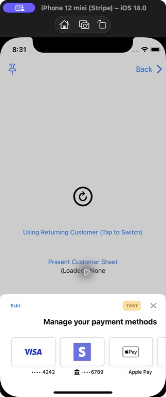
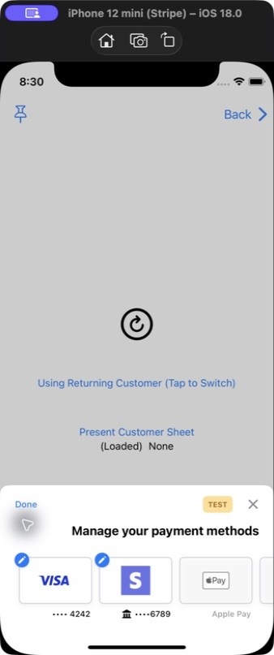
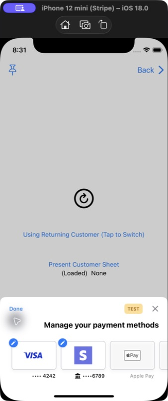
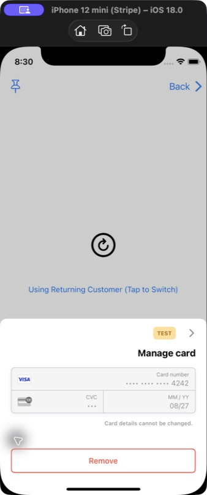
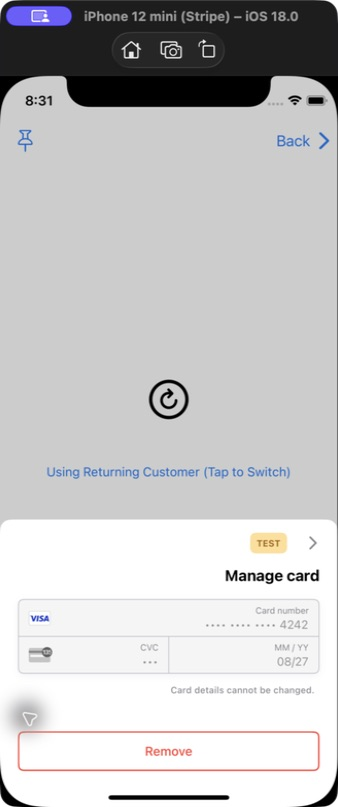

# PR5 RTL Simulator evidence

These screenshots were captured by manually operating the production-style
`CustomerSheet (SwiftUI)` example in Simulator. They are not XCTest or
snapshot-test output.

| | Value |
| --- | --- |
| Before | `767895f2741` (`codex/rtl-link`) |
| After test coverage | `d366f700d22` |
| Simulator | iPhone 12 mini, iOS 18.0 (`79CA7DB2-0A4B-4EC4-B93C-D28E8C9458F1`) |
| App | `com.stripe.PaymentSheet-Example` |
| Launch | Normal launch with `-AppleTextDirection YES -NSForceRightToLeftWritingDirection YES`; no `UITesting` environment |
| Xcode | 26.4.1 (17E202) |
| Before `StripePaymentSheet` SHA-256 | `c4c630c98f9b68274db026eae42f00592189367c2fccb99bf5c660930acd29ec` |
| After `StripePaymentSheet` SHA-256 | `c4c630c98f9b68274db026eae42f00592189367c2fccb99bf5c660930acd29ec` |

PR5 intentionally changes only tests and reference images. The byte-identical
framework hashes above confirm that it does not modify production behavior. The
separately installed before and after builds therefore serve as a negative-control
pair: they must retain the inherited RTL layout introduced lower in the stack.

## Saved payment methods

Oracle: close and edit actions occupy the RTL trailing side, the title aligns with
the interface, and saved-payment-method cards preserve their content direction.

| Before | After |
| --- | --- |
|  |  |

## Edit mode

Oracle: Done remains trailing and the per-payment-method edit affordances remain
reachable without changing carousel order or clipping.

| Before | After |
| --- | --- |
|  |  |

## Manage card

Oracle: the back control remains on the RTL trailing side and points right; card
data keeps its intrinsic LTR order; the destructive action remains fully visible.

| Before | After |
| --- | --- |
|  |  |
