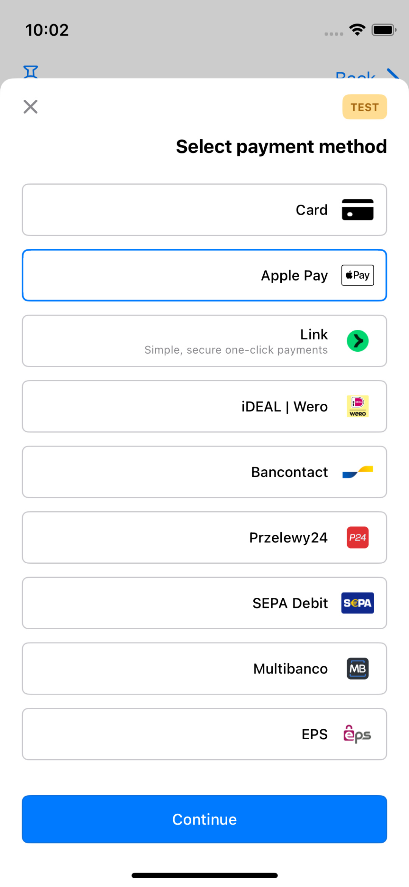
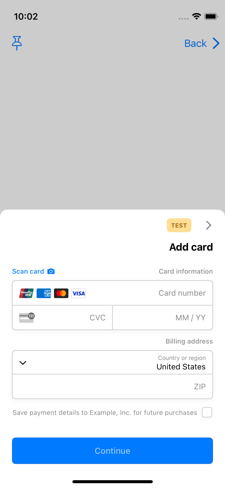
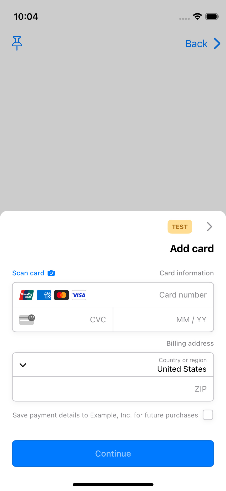

# PR6 RTL Simulator evidence

These screenshots were captured by manually operating the production-style
`PaymentSheet.FlowController (SwiftUI)` example in Simulator. They are not
XCTest or snapshot-test output.

| | Value |
| --- | --- |
| Before | `1897470df10` (`codex/rtl-customer-sheet`) |
| After test coverage | `dbd6510be5f` |
| Simulator | iPhone 12 mini, iOS 18.0 (`79CA7DB2-0A4B-4EC4-B93C-D28E8C9458F1`) |
| App | `com.stripe.PaymentSheet-Example` |
| Launch | Normal launch with `-AppleTextDirection YES -NSForceRightToLeftWritingDirection YES`; no `UITesting` environment |
| Capture | Native Simulator framebuffer via `xcrun simctl io … screenshot`; no desktop window, pointer, or overlay |
| Xcode | 26.4.1 (17E202) |
| Before `StripePaymentSheet` SHA-256 | `436b3769572f625c4fcfb45778ad27996eaeb6333d255141222233e3090d10f5` |
| After `StripePaymentSheet` SHA-256 | `436b3769572f625c4fcfb45778ad27996eaeb6333d255141222233e3090d10f5` |

PR6 intentionally changes only tests and reference images. The byte-identical
framework hashes above confirm that it does not modify production behavior. The
separately installed before and after builds therefore serve as a negative-control
pair for the RTL behavior inherited from the lower branches.

## Payment-method selector

Oracle: the close action remains on the RTL trailing side, payment-method labels
and icons follow interface direction, and brand artwork keeps its intrinsic
orientation.

| Before | After |
| --- | --- |
|  |  |

## Add card

Oracle: the back control remains on the RTL trailing side and points right;
section labels follow interface direction; card number, expiry, CVC, and card
brand content preserve their intrinsic left-to-right order.

| Before | After |
| --- | --- |
|  |  |
