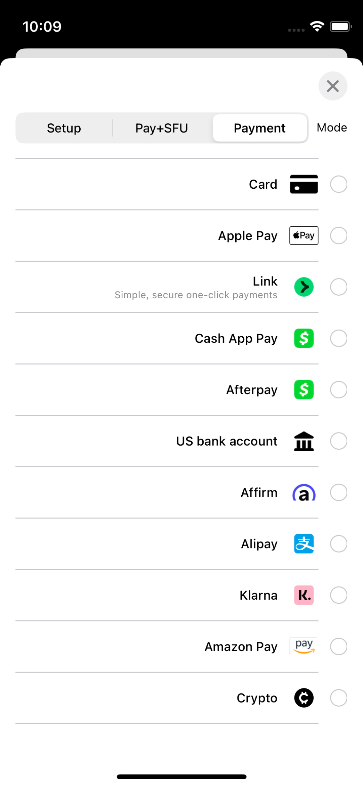
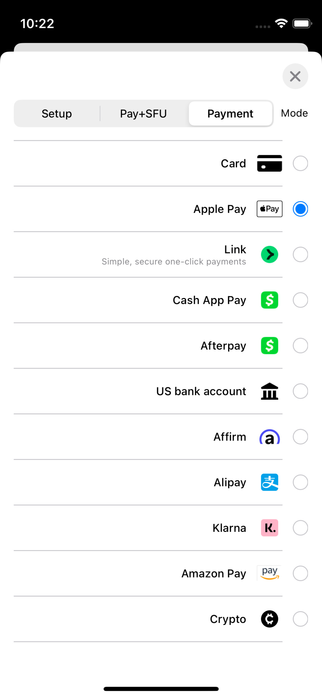
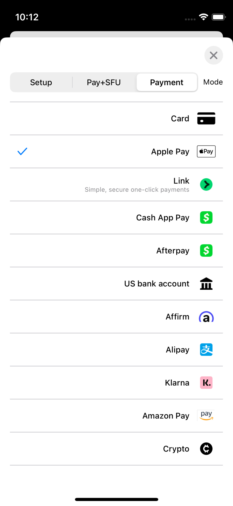
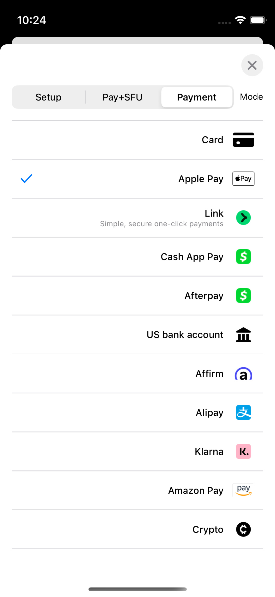
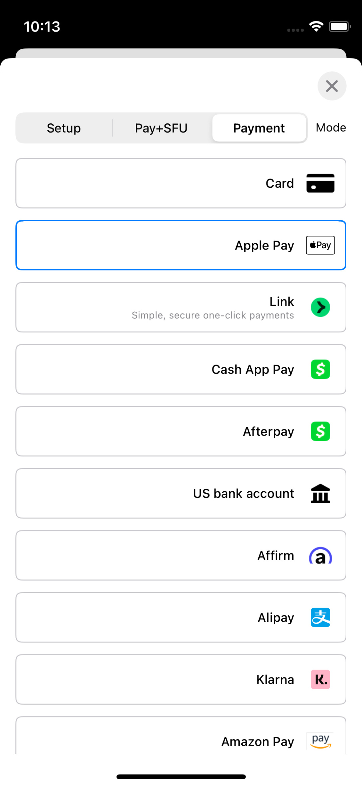
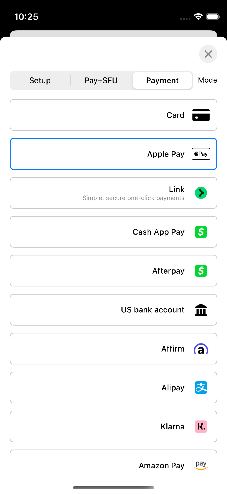
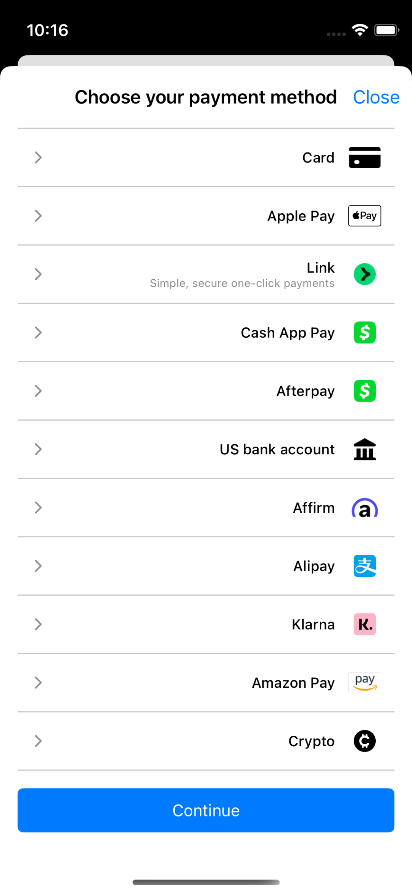
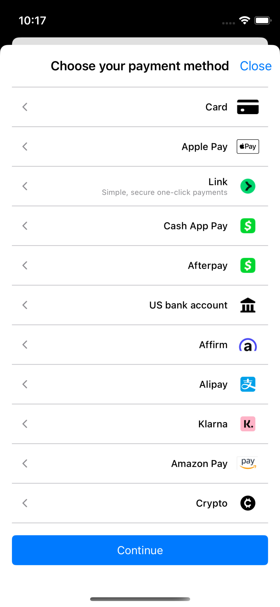

# PR7 RTL Simulator evidence

These screenshots were captured by manually operating all four
`EmbeddedPaymentElement` row styles in the production PaymentSheet playground.
They are not XCTest or snapshot-test output.

| | Value |
| --- | --- |
| Before | `8c1a3f73c47` (`codex/rtl-flow-controller`) |
| After production and test changes | `c0df100538c` |
| Simulator | iPhone 12 mini, iOS 18.0 (`79CA7DB2-0A4B-4EC4-B93C-D28E8C9458F1`) |
| App | `com.stripe.PaymentSheet-Example` |
| Launch | Normal launch with `-AppleTextDirection YES -NSForceRightToLeftWritingDirection YES`; no `UITesting` environment |
| Capture | Native Simulator framebuffer via `xcrun simctl io ... screenshot`; no desktop cursor or Simulator chrome |
| Xcode | 26.4.1 (17E202) |
| Before `StripePaymentSheet` SHA-256 | `436b3769572f625c4fcfb45778ad27996eaeb6333d255141222233e3090d10f5` |
| After `StripePaymentSheet` SHA-256 | `287f5aa8ce5579e26daa8102282078f5857c98af64ab2ccb3b3d909accf2859e` |

The first three pairs are negative controls: PR7 does not change those row
implementations, so their inherited RTL layouts should remain stable. The
flat-with-disclosure pair demonstrates PR7's production change. The default
Stripe chevron now points toward RTL forward navigation; merchant-supplied
custom disclosure artwork is deliberately not modified.

## Flat with radio

Oracle: the selection control is on the RTL leading edge, labels and icons follow
the interface direction, and payment-brand artwork preserves its orientation.

| Before | After |
| --- | --- |
|  |  |

## Flat with checkmark

Oracle: the selected-row checkmark is on the RTL leading edge and the row content
remains unclipped and correctly ordered.

| Before | After |
| --- | --- |
|  |  |

## Floating button

Oracle: row content follows the RTL interface direction while logos and masked
account data preserve their intrinsic direction.

| Before | After |
| --- | --- |
|  |  |

## Flat with disclosure

This style was exercised with the required `immediateAction` row-selection
behavior. Oracle: disclosure indicators stay on the RTL leading edge and point
left, the forward-navigation direction in RTL.

| Before | After |
| --- | --- |
|  |  |
